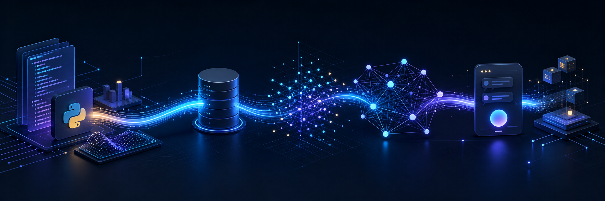

<p align="center">
  
</p>

<h1 align="center">AI Engineering Journey</h1>

<p align="center">
  A living record of my transition from software development and data foundations<br />
  to retrieval systems, AI assistants, and production-ready AI backends.
</p>

<p align="center">
  <a href="https://github.com/bilgenurpala"></a>
  
  
  
</p>

---

## About this repository

This is not a course checklist. It is the technical archive behind my evolution into an AI engineer: the concepts I study, the notebooks I use to validate them, and the engineering decisions that later appear in complete products.

My work currently sits at the intersection of **LLM applications**, **retrieval-augmented generation**, **AI-enabled backend systems**, and **reliable API design**. The progression documented here starts with Python and data analysis, moves through machine learning and deep learning, and leads into the systems I build today: local RAG assistants, tool-using workflows, evaluated retrieval pipelines, and production-oriented AI services.

## Engineering trajectory

| Stage | What I developed | Evidence |
| --- | --- | --- |
| **Foundations** | Python, data manipulation, analytical thinking, and classical ML | [`python/`](python/) / [`data-analysis/`](data-analysis/) / [`machine-learning/`](machine-learning/) |
| **Applied AI** | LLM APIs, embeddings, semantic retrieval, RAG, and deep learning | [`ai-engineering/`](ai-engineering/) / [`deep-learning/`](deep-learning/) |
| **AI products** | Grounded assistants, domain-aware recommendations, structured outputs, and failure handling | [Local RAG Assistant](https://github.com/bilgenurpala/local-rag-assistant) / [PetAdopt](https://github.com/bilgenurpala/pet-adopt) |
| **Production engineering** | FastAPI services, PostgreSQL, Docker, testing, CI, and observable backend workflows | [FlyRank Internship](https://github.com/bilgenurpala/flyrank-internship) / [Nova Store](https://github.com/bilgenurpala/nova-store) |

## Selected work

### [Local RAG Assistant](https://github.com/bilgenurpala/local-rag-assistant)

An offline document question-answering assistant developed during the **Microsoft Türkiye AI Innovators Program**. It combines local inference through Microsoft Foundry Local with document ingestion, embeddings, SQLite-backed storage, cosine-similarity retrieval, and grounded response generation. The project turned RAG from a notebook concept into a complete, privacy-conscious application.

### [PetAdopt — AI Assistant](https://github.com/bilgenurpala/pet-adopt)

Built during my **VBT Software Internship**, PetAdopt is a full-stack adoption platform with a separate Claude-powered AI service. I owned the service layer and AI service: conversational intent routing, grounded pet recommendations, listing generation, image classification, versioned prompts, retry behavior, and testable LLM boundaries. The AI component is isolated from the core FastAPI application so it can fail, scale, or evolve independently.

### [FlyRank AI Engineering Internship](https://github.com/bilgenurpala/flyrank-internship)

My current AI engineering internship, focused on backend systems and dependable AI workflows. The work includes FastAPI, Docker, PostgreSQL, retrieval-backed answer flows, structured-output pipelines, tool-calling agents, evaluation harnesses, API contracts, and explicit failure handling. The repository is organized as a series of hands-on engineering assignments rather than passive notes.

### [Nova Store](https://github.com/bilgenurpala/nova-store)

A production-oriented, AI-powered commerce platform spanning a FastAPI backend, React web client, Flutter mobile client, and MSSQL. It represents the broader software-engineering side of my AI work: integrating intelligent features into a real multi-client product instead of treating AI as an isolated demo.

## Supporting programs and labs

| Repository | Contribution to the journey |
| --- | --- |
| [Huawei Data Science & ML Bootcamp](https://github.com/bilgenurpala/huawei-data-science-bootcamp) | Python, data science, machine learning exercises, and a final applied project |
| [AI4Future](https://github.com/bilgenurpala/ai4future) | GenAI, agentic systems, RAG, and advanced AI architecture experiments |
| [Pupilica AI Bootcamp](https://github.com/bilgenurpala/pupilica-ai-bootcamp) | EDA, preprocessing, classical ML, deep learning, and NLP practice |
| [Anthropic Academy](https://github.com/bilgenurpala/anthropic-academy) | Claude API, tool use, prompt engineering, and coursework completed alongside the FlyRank internship |

## Repository map

```text
ai-learning-lab/
├── ai-engineering/      # LLM APIs, embeddings, and RAG
├── data-analysis/       # Data manipulation and exploratory analysis
├── deep-learning/       # Neural-network and NLP foundations
├── machine-learning/    # Classical ML concepts and experiments
├── mlops/               # Serving, deployment, and operational practices
├── python/              # Language foundations and reusable patterns
├── cybersecurity/       # Security foundations relevant to AI systems
└── docs/                # Development log and learning record
```

## What I am building toward

I am developing the ability to own an AI feature end to end: understand the data, design retrieval, integrate the model, expose a reliable API, evaluate the output, and operate the system under real constraints. My current direction is deeper work in **agentic systems**, **RAG evaluation**, **LLM reliability**, and **production AI infrastructure**.

---

<p align="center">
  <sub>Built through internships, applied programs, and shipped projects — continuously refined as my engineering practice evolves.</sub>
</p>
