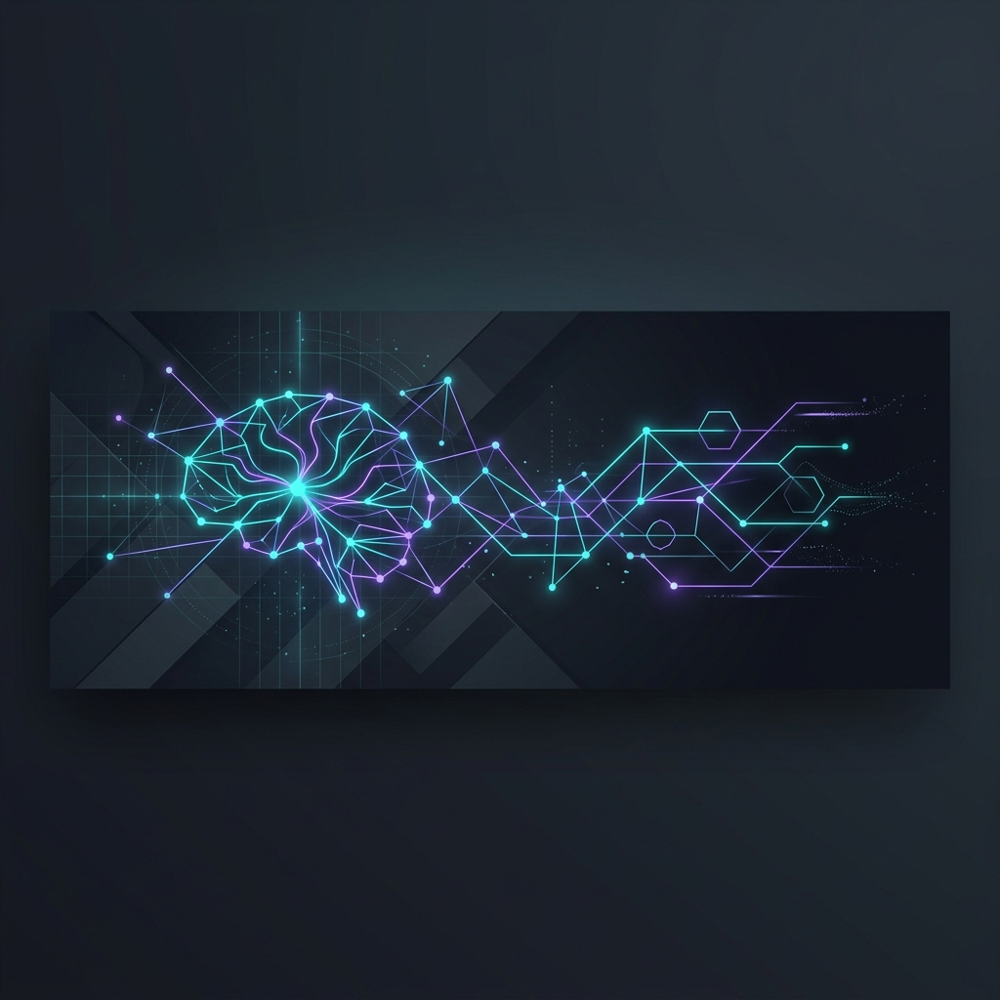

[](README.md)

# AI & Cyber-AI Learning Lab

> The master control center of my journey into AI Engineering and Cybersecurity. This repository serves as the central hub for learning notes, structured DataCamp tracks, and indexes modular projects hosted in dedicated repositories.

[](https://github.com/bilgenurpala/ai-learning-lab)
[](https://www.datacamp.com)
[](python/)
[](deep-learning/)
[](cybersecurity/)

---

## 📌 Overview

This repository is the central brain of my intensive technical mastery program (~30 hours/week), focusing on two highly synergistic fields:

1. **AI Engineering (Core Track):** Moving from Python fundamentals to Deep Learning, RAG, and MLOps using structured DataCamp courses and hands-on projects.
2. **Cybersecurity & AI Security (Parallel Track):** Understanding security fundamentals and network protocols, and exploring the intersection of **AI for Security** (anomaly detection) and **Security for AI** (LLM safety/OWASP).

This repo acts as a **Master Hub**. To keep the development clean, all major projects and tools are built in **separate, dedicated GitHub repositories** and are linked dynamically below.

All progress is logged in the [Devlog](docs/devlog.md).

---

## 🗺️ Topic-Based Roadmap

To ensure deep conceptual mastery, this roadmap is structured around core topic benchmarks rather than rigid calendar dates. Both AI and Cybersecurity are learned in parallel tracks.

| Phase | AI & Data Science Track (DataCamp Core) | Cybersecurity Track (DataCamp Parallel) | Cyber-AI Crossover & Internship Projects | Status |
| :--- | :--- | :--- | :--- | :--- |
| **Phase 1: Fundamentals** | Python Programming, OOP, Debugging | Basic IT & Security Concepts | 🔗 Command Line & Scripting Utils *(External Repo)* | 🔄 *Siber & Proje için Beklemede* |
| **Phase 2: Data Science** | Data Manipulation & Joining (Pandas), NumPy, Data Visualisation | Introduction to Cybersecurity, Network Security Basics | 🔗 Log Parsing & Data Wrangling Tools *(External Repo)* | 🔄 In Progress |
| **Phase 3: Machine Learning** | Supervised & Unsupervised Learning (Scikit-learn) | Python for Cybersecurity, Security Log Analysis | 🛡️ **Project 1:** ML-Driven Network Intrusion Detection *(External Repo)* | ⏳ Upcoming |
| **Phase 4: Deep Learning & AI** | Deep Learning with PyTorch, NLP, Transformers, LLMs, RAG | Security for AI Systems, OWASP LLM Top 10 | 🛡️ **Project 2:** Context-Aware AI Threat Intel Agent (Microsoft Internship) | ⏳ Upcoming |
| **Phase 5: MLOps & Deployment** | FastAPI, Docker, Model Deployment, API Security | Secure API Auditing & Container Hardening | 🛡️ **Project 3:** Securely Deployed Dockerized ML API *(External Repo)* | ⏳ Upcoming |

---

## 📊 Course & Notebook Progress

Here is the exact progression of my structured DataCamp learning and their respective Jupyter Notebooks in this workspace.

### 🐍 AI & Data Science Track

| Course / Topic | Notebook / Folder / Note | Status |
| :--- | :--- | :--- |
| Python Basics | [](python/python_basics.ipynb) | ✅ Done |
| Python Intermediate | [](python/python_intermediate.ipynb) | ✅ Done |
| Data Manipulation with Pandas | [](data-analysis/pandas/data_manipulation.ipynb) | ✅ Done |
| Joining Data with Pandas | [](data-analysis/pandas/joining_data.ipynb) | ✅ Done |
| Working with the OpenAI API | [](ai-engineering/llm-apis/working_with_openai_api.ipynb) | ✅ Done |
| Introduction to Embeddings with the OpenAI API | [](ai-engineering/rag/embeddings_openai_api.ipynb) | ✅ Done |
| NumPy Foundations | [](data-analysis/) | ⏳ Upcoming |
| Data Visualisation | [](data-analysis/) | ⏳ Upcoming |
| Scikit-learn (ML) | [](machine-learning/) | ⏳ Upcoming |

### 🛡️ Cybersecurity Track

| Course / Topic | Location / Note | Status |
| :--- | :--- | :--- |
| Introduction to Cybersecurity | [](cybersecurity/datacamp-notes/intro_to_cyber.md) | 🔄 Starting |
| Introduction to Data Security | [](cybersecurity/datacamp-notes/intro_to_data_security.ipynb) | ✅ Done |
| Network Security Basics | [](cybersecurity/datacamp-notes/network_security.md) | ⏳ Upcoming |
| Python for Cybersecurity | [](cybersecurity/) | ⏳ Upcoming |
| Security for AI Systems | [](cybersecurity/) | ⏳ Upcoming |

---

## 📂 Repository Structure

Each module contains structured study notes, exercises, and conceptual deep-dives. Click on a module banner inside its directory to return here, or browse using the badges.

```text
ai-learning-lab/
│
├── python/                              # Phase 1 🐍 (Python complete)
│   ├── python_basics.ipynb              # Basic control flows, collections, OOP introduction
│   └── python_intermediate.ipynb        # Ecosystem, custom functions, *args/**kwargs, error handling
│
├── data-analysis/                       # Phase 2 📊 (Current focus)
│   ├── pandas/                          # Data manipulation, merging (joining_data.ipynb ✅), aggregations
│   └── numpy/                           # Multidimensional array structures (Upcoming)
│
├── machine-learning/                    # Phase 3 🤖 (Classical ML models and preprocessing)
│   ├── supervised/                      # Classification, regression, trees, cross-validation
│   └── unsupervised/                    # Clustering, PCA dimensionality reduction
│
├── deep-learning/                       # Phase 4 🧠 (Deep neural networks & NLP architectures)
│   ├── pytorch-basics/                  # Tensors, forward pass, activation mechanics
│   └── nlp/                             # TF-IDF, Word2Vec, and Self-Attention Transformers
│
├── ai-engineering/                      # Phase 4 🔗 (RAG, Tool-use, Agent design)
│   ├── llm-apis/                        # Working with the OpenAI API notebook (working_with_openai_api.ipynb ✅)
│   └── rag/                             # OpenAI Embeddings & Vector DB notebook (embeddings_openai_api.ipynb ✅)
│
├── cybersecurity/                       # Parallel 🛡️ (IT infrastructure & Model security)
│   ├── datacamp-notes/                  # Intro to Cyber, Data Security notebook (intro_to_data_security.ipynb ✅), Network Security
│   └── README.md                        # Log parsing pipelines & intrusion models
│
└── mlops/                               # Phase 5 🚀 (Production & Serving)
    └── serving/                         # FastAPI, Docker containers, API auditing
```

---

## 🔗 Modular Project Index

All major practical implementations are developed in separate, dedicated repositories to maintain modularity and simulate professional codebases.

### 🐍 Core AI & Python Projects
*   **Phase 1 Fundamentals Projects:** Hangman · Blackjack · Caesar Cipher · Calculator · Password Generator · Silent Auction · Higher or Lower · Rock Paper Scissors (Developed in Phase 1 ✅)
*   **EDA — E-commerce Dataset** (Phase 2)
    *   *Description:* Detailed Exploratory Data Analysis on transaction data.
    *   *Repository:* `(Link coming soon after Phase 2 audit)`
*   **Titanic & End-to-end ML Pipelines** (Phase 3)
    *   *Description:* Classification models and cross-validation implementations using Scikit-learn.
    *   *Repository:* `(Link coming soon)`

### 🛡️ Cyber-AI & Advanced Projects
*   **Command Line & Scripting Utils** (Phase 1)
    *   *Description:* Automated scripting utilities and security helper scripts.
    *   *Repository:* `(Link coming soon after Phase 2 audit)`
*   **ML-Driven Network Intrusion Detection** (Phase 3)
    *   *Description:* Anomaly detection on network traffic logs using Scikit-learn supervised learning.
    *   *Repository:* `(Link coming soon)`
*   **Securely Deployed Dockerized ML API** (Phase 5)
    *   *Description:* Production-grade FastAPI microservice serving ML predictions, containerized via Docker and audited for OWASP API vulnerabilities.
    *   *Repository:* `(Link coming soon)`

---

## 💼 Professional Development, Bootcamps & Internships

This section indexes key bootcamps, internships, and specialized programs where I actively apply and expand my AI Engineering skills on real-world projects and production-grade architectures. Clicking on the titles will navigate you directly to their respective repositories.

### 🐍 [Pupilica AI Bootcamp](https://github.com/bilgenurpala/pupilica-ai-bootcamp)
*   **Role / Program:** Live AI Engineering Training Track
*   **Focus Areas:** Intensive bootcamp covering advanced data preprocessing, feature scaling, classical supervised/unsupervised machine learning pipelines, and deep neural network designs.
*   **Repository:** [](https://github.com/bilgenurpala/pupilica-ai-bootcamp)

### 🤖 [IBM & Kodluyoruz AI4Future Bootcamp](https://github.com/bilgenurpala/ai4future)
*   **Role / Program:** Bootcamp Participant (IBM SkillsBuild AI Track)
*   **Focus Areas:** Comprehensive curriculum covering AI literacy, machine learning models, NLP, computer vision, generative AI, prompt engineering, multi-agent systems, RAG architectures, and AI ethics.
*   **Repository:** [](https://github.com/bilgenurpala/ai4future)

### 🏢 [FlyRank AI Engineer Internship](https://github.com/bilgenurpala/flyrank-project)
*   **Role / Program:** AI Engineer Intern
*   **Focus Areas:** Systems, data, and backend AI product development. Focuses on designing API contracts, retrieval-backed answer flows (RAG prototypes), structured-output pipelines, tool-calling agent workflows, and evaluation harnesses while owning correctness and failure handling.
*   **Repository:** [](https://github.com/bilgenurpala/flyrank-project)

### 🛡️ [Microsoft Turkey AI Innovators Program](https://github.com/bilgenurpala/microsoft-ai-project)
*   **Role / Program:** Program Participant & AI Developer
*   **Focus Areas:** Building and optimizing local retrieval pipelines, context injection, and local models.
*   **Target Project:** *"Building Your First Local RAG Application with Foundry Local"* — a complete local RAG system running on local hardware.
*   **Repository:** [](https://github.com/bilgenurpala/microsoft-ai-project)

---

## 🛠️ Data-Driven Resources

| Track | Platform / Resource | Description |
| :--- | :--- | :--- |
| **AI / Data Science** | [DataCamp](https://www.datacamp.com) | Core structured curriculum for Python, Pandas, NumPy, Scikit-learn, and PyTorch. |
| **Cybersecurity** | [DataCamp](https://www.datacamp.com) | Parallel curriculum for Cybersecurity, Networking, and AI Safety. |
| **ML Intuition** | [StatQuest](https://www.youtube.com/@statquest) | Deep mathematical and conceptual intuition for algorithms. |
| **DL & LLMs** | [Andrej Karpathy](https://www.youtube.com/@AndrejKarpathy) | Neural networks and LLMs from scratch. |
| **Math & Visuals** | [3Blue1Brown](https://www.youtube.com/@3blue1brown) | Linear algebra, calculus, and neural network math. |

---

> *"The future of cybersecurity is AI-driven; the future of AI is secure."*
