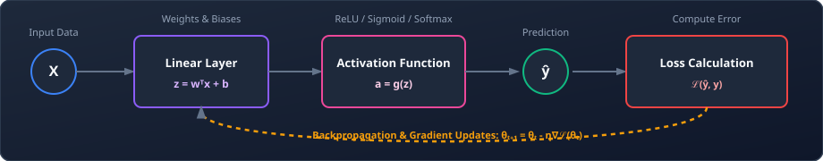

# Deep Learning & NLP

> This space tracks my Phase 4 journey, covering deep neural network architectures, activation functions, backpropagation mechanics, RNN/LSTM sequence models, Word Embeddings, and Self-Attention Transformers using PyTorch.

---

## 📂 What's in this folder

| Directory / Package | Type / Access Badge | Description | Status |
| :--- | :--- | :--- | :--- |
| `pytorch-basics/` |  | Tensor operations, dynamic computation graphs (`autograd`), and linear units. | ⏳ Upcoming |
| `computer-vision/` |  | Convolutional Neural Networks (CNNs), kernel filters, and image classification. | ⏳ Upcoming |
| `nlp/` |  | Recurrent networks, TF-IDF representations, Word2Vec, and Transformer encoders. | ⏳ Upcoming |

---

## 🧮 Theoretical & Mathematical Foundations

Deep Learning replaces hand-crafted features with representation learning using multi-layered parameter optimization.

### 1. The Feedforward Neuron Pass
A single node computes a linear combination of its inputs and applies a non-linear activation.
*   **Linear Projection ($z$):**
    $$z = w^T x + b = \sum_{i=1}^d w_i x_i + b$$
*   **Activation Output ($a$):**
    $$a = g(z)$$
    Where $x$ is the input vector, $w$ is the weights vector, $b$ is the bias scalar, and $g$ is a non-linear activation.

---

### 2. Common Activation Functions
Activations introduce non-linearity into the network, enabling it to learn complex decision boundaries.
*   **Rectified Linear Unit (ReLU):**
    $$\text{ReLU}(z) = \max(0, z)$$
*   **Logistic Sigmoid ($\sigma$):**
    $$\sigma(z) = \frac{1}{1 + e^{-z}}$$
*   **Softmax Function:**
    Converts raw outputs (logits) into a probability distribution over $C$ classes:
    $$\text{Softmax}(z)_i = \frac{e^{z_i}}{\sum_{j=1}^C e^{z_j}}$$

---

### 3. Recurrent Neural Network (RNN) State Updates
To process sequential data (e.g. text/time series), recurrent nodes maintain a hidden state vector $h_t$ that carries historical information.
$$h_t = \tanh(W_{hh} h_{t-1} + W_{xh} x_t + b_h)$$
Where $h_{t-1}$ is the previous hidden state, $x_t$ is the current input token vector, $W$ represent weight matrices, and $b$ is the bias vector.

---

### 4. Natural Language Processing & Attention Mechanics

*   **TF-IDF Word Weighting:**
    Measures the relative importance of a term $t$ in a document $d$ within a corpus $D$.
    $$\text{TF}(t, d) = \frac{f_{t,d}}{\sum_{t' \in d} f_{t',d}}, \quad \text{IDF}(t, D) = \log\left(\frac{1 + |D|}{1 + |\{d \in D : t \in d\}|}\right) + 1$$
    $$\text{TF-IDF}(t, d, D) = \text{TF}(t, d) \times \text{IDF}(t, D)$$

*   **Word2Vec Vector Probability (Skip-gram):**
    Predicts context words $w_O$ given target word $w_I$:
    $$P(w_O \mid w_I) = \frac{e^{{v'_{w_O}}^T v_{w_I}}}{\sum_{w=1}^W e^{{v'_{w}}^T v_{w_I}}}$$
    Where $v_w$ and $v'_w$ are target and context vector spaces of the vocabulary.

*   **Transformer Scaled Dot-Product Self-Attention:**
    Allows words in a sequence to attend to all other words, dynamically capturing contextual relationships.
    $$\text{Attention}(Q, K, V) = \text{softmax}\left(\frac{Q K^T}{\sqrt{d_k}}\right) V$$
    Where $Q$, $K$, and $V$ are Query, Key, and Value matrices, and $d_k$ is the scaling factor (dimension of the key vectors).

---

## 🔗 Feedforward & Backpropagation Computational Flow

The diagram below details the forward pass computations and the corresponding backpropagation gradient update loops that train deep neural architectures.

---

## 🎯 Navigation

`[← Machine Learning](../machine-learning/) | [Next: AI Engineering →](../ai-engineering/)`
