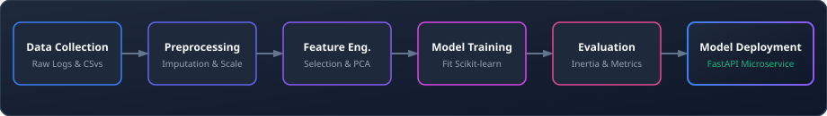

# Machine Learning Foundations

> This space tracks my Phase 3 journey, covering supervised and unsupervised learning algorithms, regression/classification trees, clustering mechanisms, dimensionality reduction, and gradient-based optimization using Scikit-Learn.

---

## 📂 What's in this folder

| Directory | Type / Access Badge | Description | Status |
| :--- | :--- | :--- | :--- |
| `supervised/` |  | Regression, Logistic Classification, Decision Trees, and Random Forests. | ⏳ Upcoming |
| `unsupervised/` |  | K-Means clustering, hierarchical clustering, and PCA dimensionality reduction. | ⏳ Upcoming |
| `projects/` |  | Indexing ML pipelines (e.g. Titanic classification, Network Anomaly Detection). | ⏳ Upcoming |

---

## 🧮 Theoretical & Mathematical Foundations

Classical Machine Learning relies heavily on probability theory, matrix calculus, and multivariate optimization.

### 1. Decision Trees: Splitting Criteria & Information Theory
Decision trees split nodes to maximize sample homogeneity (purity). We measure this using Gini or Entropy.

*   **Gini Impurity ($I_G$):**
    Measures the probability of misclassifying a randomly chosen element from the set:
    $$I_G(p) = 1 - \sum_{i=1}^J p_i^2$$
    Where $p_i$ is the probability of an item belonging to class $i$.
*   **Shannon Entropy ($H$):**
    Measures the expected information content or uncertainty of a random variable $X$:
    $$H(X) = -\sum_{i=1}^n P(x_i) \log_2 P(x_i)$$
*   **Information Gain ($IG$):**
    The reduction in entropy achieved by partitioning a dataset $T$ based on feature $a$:
    $$IG(T, a) = H(T) - H(T \mid a)$$

---

### 2. K-Means: Clustering Optimization & Inertia
K-Means partitions $n$ observations into $k$ clusters, where each observation belongs to the cluster with the nearest mean (centroid).
*   **Within-Cluster Sum of Squares (WCSS) / Inertia:**
    The objective function minimized by K-Means:
    $$WCSS = \sum_{i=1}^k \sum_{x \in S_i} \|x - \mu_i\|^2$$
    Where $S_i$ is the set of points in cluster $i$, and $\mu_i$ is the centroid of $S_i$.

---

### 3. Principal Component Analysis (PCA)
A linear dimensionality reduction technique that projects data onto directions of maximum variance.
1. Given a mean-centered data matrix $X$, compute the **Covariance Matrix** $\Sigma$:
   $$\Sigma = \frac{1}{n-1} X^T X$$
2. Compute the eigenvectors and eigenvalues of $\Sigma$:
   $$\Sigma v_i = \lambda_i v_i$$
3. Project the data $X$ onto the top $k$ eigenvectors (loadings matrix $V$):
   $$Z = X V$$

---

### 4. Gradient Descent Optimization
Iterative optimization algorithm used to minimize a loss function $J(\theta)$ by updating parameters in the opposite direction of the gradient vector.
$$\theta_{t+1} = \theta_t - \eta \nabla J(\theta_t)$$
Where $\theta$ represents the parameter vector (weights/biases), $\eta > 0$ is the learning rate, and $\nabla J(\theta_t)$ is the gradient of the loss function.

---

## 🔗 End-to-End ML Pipeline

The flowchart below outlines the typical lifecycle of data ingestion, preprocessing, engineering, training, evaluation, and production serving.

---

## 🎯 Navigation

`[← Data Science & Analysis](../data-analysis/) | [Next: Deep Learning →](../deep-learning/)`
